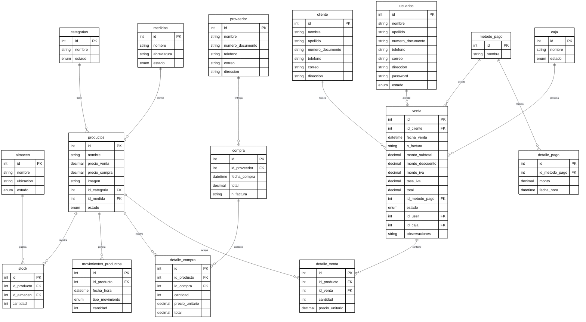

# Diagrama ER generado a partir del SQL del proyecto

```mermaid
%%{init: {'theme': 'base', 'themeVariables': {
  'fontFamily': 'Arial',
  'fontSize': '22px',
  'lineColor': '#000000',
  'primaryBorderColor': '#000000',
  'primaryTextColor': '#111111',
  'mainBkg': '#ffffff',
  'nodeBorder': '#000000'
}}}%%
erDiagram
    categorias {
        int id PK
        string nombre
        enum estado
    }

    medidas {
        int id PK
        string nombre
        string abreviatura
        enum estado
    }

    almacen {
        int id PK
        string nombre
        string ubicacion
        enum estado
    }

    proveedor {
        int id PK
        string nombre
        string numero_documento
        string telefono
        string correo
        string direccion
    }

    cliente {
        int id PK
        string nombre
        string apellido
        string numero_documento
        string telefono
        string correo
        string direccion
    }

    metodo_pago {
        int id PK
        string nombre
    }

    usuarios {
        int id PK
        string nombre
        string apellido
        string numero_documento
        string telefono
        string correo
        string direccion
        string password
        enum estado
    }

    caja {
        int id PK
        string nombre
        enum estado
    }

    productos {
        int id PK
        string nombre
        decimal precio_venta
        decimal precio_compra
        string imagen
        int id_categoria FK
        int id_medida FK
        enum estado
    }

    stock {
        int id PK
        int id_producto FK
        int id_almacen FK
        int cantidad
    }

    movimientos_productos {
        int id PK
        int id_producto FK
        datetime fecha_hora
        enum tipo_movimiento
        int cantidad
    }

    compra {
        int id PK
        int id_proveedor FK
        datetime fecha_compra
        decimal total
        string n_factura
    }

    detalle_compra {
        int id PK
        int id_producto FK
        int id_compra FK
        int cantidad
        decimal precio_unitario
        decimal total
    }

    venta {
        int id PK
        int id_cliente FK
        datetime fecha_venta
        string n_factura
        decimal monto_subtotal
        decimal monto_descuento
        decimal monto_iva
        decimal tasa_iva
        decimal total
        int id_metodo_pago FK
        enum estado
        int id_user FK
        int id_caja FK
        string observaciones
    }

    detalle_venta {
        int id PK
        int id_producto FK
        int id_venta FK
        int cantidad
        decimal precio_unitario
    }

    detalle_pago {
        int id PK
        int id_metodo_pago FK
        decimal monto
        datetime fecha_hora
    }

    categorias ||--o{ productos : tiene
    medidas ||--o{ productos : define
    productos ||--o{ stock : registra
    almacen ||--o{ stock : guarda
    productos ||--o{ movimientos_productos : genera
    proveedor ||--o{ compra : entrega
    productos ||--o{ detalle_compra : incluye
    compra ||--o{ detalle_compra : contiene
    cliente ||--o{ venta : realiza
    metodo_pago ||--o{ venta : acepta
    usuarios ||--o{ venta : atiende
    caja ||--o{ venta : procesa
    productos ||--o{ detalle_venta : incluye
    venta ||--o{ detalle_venta : contiene
    metodo_pago ||--o{ detalle_pago : registra
```
